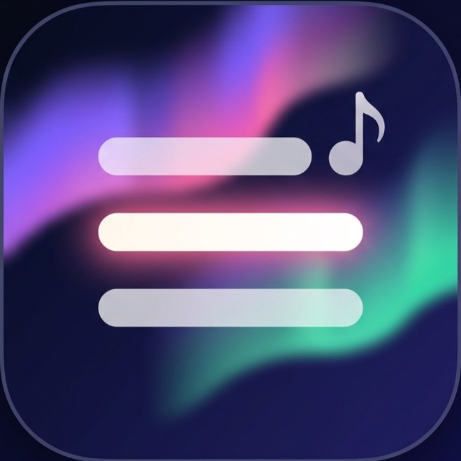
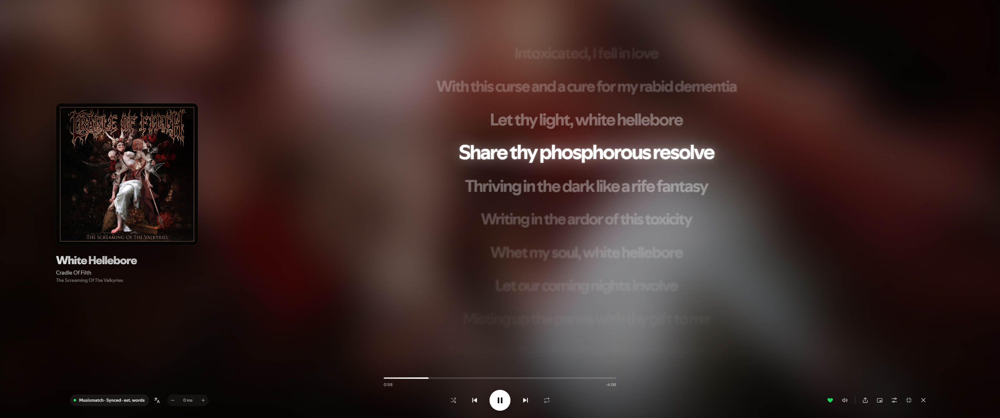

<p align="center"></p>

<h1 align="center">Aurora Lyrics</h1>

**Beautiful, full-screen lyrics for Spotify that light up word by word as the song plays.**

A [Spicetify](https://spicetify.app) extension for Spotify Desktop.



## Why you'll like it

- 🎤 **Word-by-word lyrics** from Apple Music, Musixmatch, NetEase and more. Each word lights up as it's sung.
- 🌌 **Looks gorgeous**: the album art drifts behind the lyrics, lines glide in with a soft spring, and the current line glows.
- 🎨 **Make it yours**: 7 layouts, 12 one-click themes, 11 line motions, 11 word animations, fonts, colours and your own accent colour.
- 🌍 **Translate** any song into your language with one key.
- 🪟 **Mini lyrics**: a small floating lyrics bar that stays on screen while you browse Spotify.
- 📸 **Share** your favourite lines as a ready-to-post image or an animated clip.
- 🎸 **Guitar tabs**: one click to the song's tab on Songsterr.
- 💬 **Lyrics in the Now Playing panel**: Spotify's small lyrics preview is replaced by a live, synced one.

## Install

You need [Spicetify](https://spicetify.app/docs/getting-started) installed first.

**From the Spicetify Marketplace (easiest):** open the Marketplace in Spotify, search for **Aurora Lyrics**, and click *Install*.

**Manually (Windows):** download this repository, open PowerShell in its folder and run:

```powershell
.\install.ps1
```

Spotify restarts, and you're ready.

**To uninstall:** remove it in the Marketplace, or run `.\install.ps1 -Uninstall`.

## Getting started

1. Play a song.
2. Press **Alt+L**, or click the lyrics button in Spotify's top bar or player bar.
3. That's it. Move the mouse to show the controls; they hide again when you stop.

Press **Esc** to close.

## Keyboard shortcuts

| Key | What it does |
| --- | --- |
| **Alt+L** | Open or close the lyrics |
| **Alt+M** | Show or hide mini lyrics |
| **Esc** | Close (closes an open panel first) |
| **T** | Translation on / off |
| **S** | Share lyrics as an image |
| **G** | Guitar tabs on Songsterr |
| **F** | Fullscreen |
| **[** and **]** | Lyrics too early or too late? Nudge them by 0.1 s |

With the mouse:

- **Click a line** to jump to that part of the song.
- **Scroll** to read ahead; the view returns to the current line on its own.
- **Right-click a line** to share it.
- **Click the artist or album name** to open its page in Spotify.
- **Click the big cover** to play or pause.

## Features

### Lyrics that follow the music

- Words light up as they're sung, in 11 styles: **Fill**, **Glow**, **Pop**, **Rise**, **Letters**, **Karaoke**, **Focus** (blur to sharp), **Bounce**, **Neon** (flickers on in colour), **Typewriter** and **Shimmer** (a band of light sweeps through).
- Lines move in 11 styles (*Motion → Style*): **Flow**, **Slide**, **Scale**, **Spring**, **Wheel** (a 3D drum) and **Depth** (lines float in 3D and the scene tilts towards your mouse) scroll the whole song; **Fade**, **Cinematic**, **Swipe**, **Zoom** and **Flip** (split-flap) show one line at a time.
- Background vocals appear as a smaller line under the main one.
- In **duets**, each singer gets their own colour and side.
- Instrumental breaks show three dots that fill up until the singing starts again.
- Songs with only line timing can get estimated word timing (*Motion → Words*).

### Layouts and themes

- **Layouts** (*Look → Layout*): Split, Mirrored, Poster, Vinyl (a spinning record), Stage, Captions, and Lyrics only.
- **Themes** (*Look → Theme*): Aurora, Neon, Minimal, Karaoke, Gothic, Black Metal, Lounge, Retro (amber terminal), Synthwave, Zen, Sunset, Midnight, Vaporwave, Ocean and Rain, applied in one click. Your own settings are kept as *Custom*, so you can always go back. Each theme also brings its own **ambience**: aurora ribbons, CRT scanlines (Retro), a neon grid and sun (Synthwave), a KTV room in WebGL with sweeping spotlights, a mirror ball scattering light and segmented glass equaliser columns, the lyrics on a glossy violet caption bar with a bead bouncing over the words (Karaoke), long glass tubes of neon light over a wet floor, in a WebGL room whose colours follow the album, with tube lettering that lights up word by word (Neon), a cathedral at night: a rose window of stained glass high in the dark, its light falling in coloured shafts, candles at both sides, the line being sung in a leaded pane (Gothic), a frozen forest in falling snow (Black Metal), a moon rising over the song (Midnight), a pastel dream with a checker floor that rolls in tempo, a ringed planet, VHS grain and an old OS window for the cover (Vaporwave), a dive that lasts one song, from sunlit shallows with a manta ray to a dark sea of glowing jellyfish, with the cover as a porthole (Ocean), a rainy night window drawn live on your GPU: a misted-glass view of a night city, drops that are real little lenses showing the street upside down, bigger drops that run in fits and starts and wipe a clear trail, cars passing, lightning, neon in the album's colours (Rain; it falls back to a lighter CSS version without WebGL) and more. Changing any look setting on a theme turns it into a Custom look, which has no ambience; the Custom card does the same. Where Spotify has beat data, the ambience moves with the beat. Turn it off with *Look → Theme → Theme ambience*.
- **Liquid glass**: the remade themes (Neon, Minimal, Karaoke and Gothic so far; the rest follow) share one glass look: a frosted pane that glides and quivers behind the line being sung, a control bar of three glass islands, a framed cover, and real edge refraction that bends what is behind the glass. If it ever feels slow, switch off *Look → Theme → Glass refraction* (the scene also does that on its own when frames run slow).
- **Accent colour**: taken from the album cover, or pick your own.
- **Album gradient** text (*Look → Text → Colour*): each line runs from one album colour to another.
- Eight fonts (including Mono and Condensed), four weights, text size, spacing, alignment, glow strength, and background style (album art, gradient, solid, or **your own image or video**: *Look → Background → Custom*, with optional blur; a video plays along with the music).

### Mini lyrics

Press **Alt+M** for a small floating bar with the current line and the next one. It stays on screen while you use the rest of Spotify.

- Five styles (*General → Interface → Mini lyrics style*): Glass, Compact (a slim pill), Bar (a wide karaoke bar), Floating (just text, no box) and Neon.
- Drag it anywhere; it remembers where you left it.
- Click the text to go back to full screen.
- Hover it for the **pop-out** button, which turns it into a separate always-on-top window (if your Spotify version supports it).

### Share as an image

Press **S** (or right-click a line) and build a ready-to-post image:

- **Lines**: pick up to eight. Shift-click selects a range; *Current line* and *Clear* are one click.
- **Style**: Classic, Card (a floating card, like Spotify's own), Centered, or Quote (a big quotation mark).
- **Size**: Square, Portrait or Story.
- **Background**: blurred album art, gradient, accent colour, dark or light.
- **Text**: left or centred, and a size slider.
- **Extras**: text glow on or off, cover and track info, the translation under each line (when translation is on), and a small *Aurora Lyrics* credit.

Then **Copy image** (or Ctrl+C) and paste it anywhere, **Save PNG**, **Share…** (when your system supports it), or **Copy text** to paste the lines as plain text.

**Record clip** makes a short video (up to 15 s) of the same card with your lines lighting up word by word at the song's real timing, ready for Stories. It records live while you watch, saves as MP4 where supported (otherwise WebM), and is silent (extensions can't capture Spotify's audio). Your choices are remembered for next time.

### Translation

Press **T** to show a translation under every line, in your Spotify language or any language you choose (*Sources → Translation*). Lines already in your language aren't repeated.

### Guitar tabs (Songsterr)

Press **G** or the guitar-pick button. A small card shows which parts Songsterr has for the song (guitar, bass, drums…) and how hard the guitar part is. Click **Open tab** to play along on songsterr.com in your browser. If there's no tab yet, you can search Songsterr instead. You can hide the button in *General → Interface*.

### Up next

In the last 20 seconds of a song, a small card shows what's playing next. Click it to skip straight to it.

### Now Playing panel

Spotify's lyrics card in the right-hand panel is replaced by a live one: synced, with words filling in and click-to-jump on every line. You can turn it off in *General → Interface*.

## Where the lyrics come from

Aurora Lyrics searches these sources, in an order you can change (*Sources*):

| Source | Word by word? |
| --- | --- |
| Apple Music | ✅ (also background vocals and duets) |
| Musixmatch | ✅ on many popular songs |
| Spotify | Line by line |
| NetEase | ✅, great for Asian music |
| LRCLIB | Line by line |
| Unison | ✅ on some songs |

The first lyrics found appear right away. If a better version (with word timing) turns up a moment later, the view upgrades in place. Every result is checked against the playing song, so you won't get a cover version or the wrong language.

**Wrong or missing lyrics?** Click the source chip at the bottom left. From there you can:

- pick a different source for this song (remembered for next time);
- paste lyrics, or import an `.lrc` / `.txt` file. Your own lyrics always win.

## Troubleshooting

- **Lyrics are a bit early or late.** Use **[** and **]**, or the − / + buttons at the bottom left. Click the number to reset it.
- **"No lyrics found".** Try another source from the source chip, or import your own. Some songs have no synced lyrics anywhere yet.
- **Musixmatch is skipped.** It sometimes limits requests; Aurora Lyrics waits a few minutes and uses the next source meanwhile.
- **It feels slow on an older PC.** Pick the *Slide* animation and turn off *Depth blur* (*Motion*).
- **The pop-out button says it isn't available.** Your Spotify version can't open extra windows; the mini lyrics bar inside Spotify still works.
- **Looking for a setting?** Click the sliders icon at the bottom right; there's a search box at the top.

## Privacy

Aurora Lyrics has no account and no tracking. It only contacts:

- the lyrics sources above, to find lyrics;
- Google Translate, only when translation is on;
- Songsterr's song search, only when you open the guitar tabs card;
- Google Fonts, only if you choose one of the web fonts.

Your settings and imported lyrics stay on your computer.

---

## For developers

Needs Node 18+ to build. No dependencies.

```powershell
npm test                    # unit tests
node build.mjs              # build once → dist/aurora-lyrics.js
npm run preview             # http://localhost:5178/dev/preview.html (mock Spotify, no install needed)
                            # add ?loop to repeat the current mock track instead of auto-advancing

# Live development inside Spotify:
node build.mjs --watch --out "$(spicetify path userdata)\Extensions"
spicetify watch -e          # reloads Spotify when the extension file changes
```

Manual install without the script:

```powershell
node build.mjs
Copy-Item dist\aurora-lyrics.js "$(spicetify path userdata)\Extensions\"
spicetify config extensions aurora-lyrics.js
spicetify apply
```

From DevTools (`spicetify enable-devtools`) you can call `AuroraLyrics.open()`, `.close()`, `.toggle()`, `.toggleMini()` and `.testSources()`.

### Project layout

```text
src/
  main.js        entry: waits for Spicetify, injects CSS, buttons, player listeners
  overlay.js     overlay controller: DOM, playback loop, lyric loading, settings → CSS
  view.js        LyricsView: renders lines, active-line/word tracking, layouts
  panel.js       settings drawer (generated from the schema) + lyrics import editor
  npv.js         lyrics card in Spotify's Now Playing panel
  mini.js        mini lyrics pill (drag, Alt+M, styles, Document Picture-in-Picture pop-out)
  media.js       custom background image / video, stored in IndexedDB
  share.js       share sheet + canvas renderer for lyric images
  tabs.js        Songsterr lookup (public song search → tab link, parts, difficulty)
  translate.js   line-by-line translation (batched, aligned, cached)
  providers.js   Spotify + LRCLIB providers, registry, and the resolver (quality tiers, upgrades, pinning)
  net.js         fetch / CORS-proxy / Spotify-auth helpers (no CosmosAsync for third-party hosts)
  sources.js     Musixmatch, NetEase, Unison and Apple Music (Paxsenix) network code
  formats.js     pure converters: Musixmatch richsync, NetEase YRC, TTML, Paxsenix JSON
  lrc.js         lyrics model, LRC / enhanced LRC / plain parsers, word-timing estimator, LRC serializer
  cache.js       LRU lyrics cache (TTL + negative cache) and imported-lyrics store
  settings.js    settings schema, themes, defaults, validation, persistence
  glass.js       liquid-glass refraction: SVG displacement filters used as backdrop filters
  scenes.js      WebGL theme scenes: the renderer, the colour maths (OKLCH palettes) and the scene registry
  scene-glsl.js  GLSL shared by the scenes;  scene-neon.js, scene-karaoke.js, scene-gothic.js  one file per scene
  storage.js     Spicetify.LocalStorage → localStorage → memory; moves data saved under the old name
  player.js      defensive wrappers for Spicetify.Player (track info, position, queue, page links)
  icons.js       inline SVG icons
  util.js        helpers
  styles.css     all styles (inlined into the bundle at build time)
  glass.css      the liquid-glass kit shared by the glass themes;  themes/*.css  one stylesheet per remade theme
build.mjs        zero-dependency bundler → dist/aurora-lyrics.js
test/            node:test unit tests
dev/             browser preview harness with a mocked Spicetify (preview.html: ?theme=neon&pos=13000&set=view:"lyrics"); shader.html renders one WebGL scene on its own and shows compile errors
install.ps1      install / uninstall helper
```

The sources are ES modules so the tests can import them directly. The build strips `import`/`export` and concatenates the files into one IIFE, because Spicetify loads an extension as a single classic script. Top-level names must be unique across `src/` files; the build checks this.

### How the sources are reached

| Source | Timing | How it's reached |
| --- | --- | --- |
| Apple Music (Paxsenix) | word/syllable, background vocals, duets | iTunes Search finds the Apple track (validated), then the community Paxsenix API returns Apple's lyrics; both called directly |
| Musixmatch | word (richsync), line, plain | mobile API through the CORS proxy with a free token (the tokenless desktop API returns a decoy song, so it is never used) |
| Spotify | line (rarely syllable) | Spotify's lyrics endpoint, called directly with your session token |
| NetEase | word (YRC), line | NetEase Cloud Music's API, through the CORS proxy |
| LRCLIB | line, plain | open community database, called directly |
| Unison | word (TTML, with background vocals) | better-lyrics community database, called directly |

### Known limitations

- **Spotify's lyrics endpoint is internal.** `spclient…/color-lyrics/v2` is undocumented and can change or be region/account-restricted.
- **Why not CosmosAsync.** On Spotify 1.3.x, Spicetify 2.45.1 sends every `CosmosAsync` request to Spotify's native resolver, which throws "Resolver not found" for non-Spotify hosts and drops custom headers. The extension uses `fetch()` directly where CORS allows it, and Spicetify's CORS proxy (`cors-proxy.spicetify.app`, or your `spicetify:corsProxyTemplate`) for NetEase and the Musixmatch mobile API.
- **Unofficial APIs.** Musixmatch, NetEase, Paxsenix and Unison are used the way community lyrics apps use them. Any of them can change, rate-limit, or disappear. Rate-limited sources are skipped for a few minutes.
- **Musixmatch needs a token**, and Musixmatch captcha-limits token requests per IP. The CORS proxy is shared by all Spicetify users, so tokens sometimes can't be obtained; Musixmatch is then skipped for 15 minutes. If you use lyrics-plus, its saved token is reused.
- **The offset is global, not per track.** For a single track, import lyrics with an `[offset:]` tag.
- **Unsynced auto-scroll is an estimate** based on track progress.
- **Document Picture-in-Picture** (mini lyrics pop-out) depends on the Spotify build's Chromium shell.
- Imported lyrics and the cache live in LocalStorage: per machine, not synced.

### Manual test checklist

- [ ] Alt+L and both buttons open and close the overlay. Esc closes it, and Spotify's UI is unaffected afterwards.
- [ ] A synced track: the active line follows playback through seeks, pause/resume and track changes.
- [ ] Repeat-one: lyrics restart at the top when the track loops.
- [ ] Unsynced lyrics auto-scroll; scrolling manually pauses auto-scroll for about 5 s.
- [ ] No lyrics / podcast episodes show the right message.
- [ ] Offset buttons and `[` `]` shift timing, and the value persists after restarting Spotify.
- [ ] Every setting updates live; reduced motion leaves only short fades.
- [ ] Import an `.lrc` with `[offset:]` and word tags; *Remove imported* reverts to the online source.
- [ ] Picking a source for a track sticks after reopening; *Auto* goes back to the normal search.
- [ ] A duet with Apple Music lyrics: the second singer's lines are coloured and on the opposite side.
- [ ] Each theme applies; changing a setting afterwards shows *Custom*, and *Custom* restores your look.
- [ ] Alt+M shows the mini pill; it follows the song, can be dragged, and remembers its position.
- [ ] S opens the share sheet; *Copy image* and *Save PNG* work, and the cover art appears in the image.
- [ ] Near the end of a song, *Up next* shows the next queued track; clicking it skips.
- [ ] Clicking the artist or album name opens its page and closes the overlay.
- [ ] Resize from very narrow to large: lines wrap and stay centred; small windows fall back to lyrics only.

### Ideas

- Per-track offset stored alongside the cache
- Romanization (Korean, Japanese kana) under each lyric
- Tap-to-sync editor for creating LRC timings from plain lyrics
- Background prefetch of the next queued track's lyrics
- Export current lyrics as `.lrc`

## License

MIT
